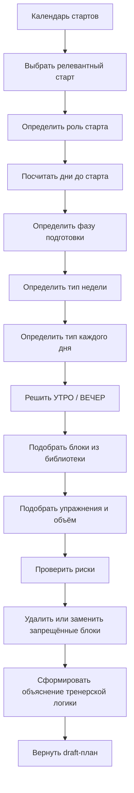

# PERFORM Constructor Phase Matrix Transition Plan

Версия: черновик v1, 2026-06-09

Назначение: зафиксировать переход конструктора подготовки от старой `template-driven` логики к новой `matrix-driven` логике, где календарь стартов и фаза подготовки определяют структуру недели, дня, утро/вечер, блоки, упражнения, объём, риски и объяснение.

На этом этапе бизнес-логика не меняется. Документ фиксирует карту текущей реализации, целевую матрицу, алгоритм, типы, план миграции и тесты. Большой рефакторинг конструктора можно делать только после утверждения этой схемы.

## 1. Текущая реализация

### 1.1 Где находится "голова" конструктора

| Что ищем | Файл / функция | Что делает сейчас |
| --- | --- | --- |
| Старт из календаря | `apps/web/app/page-client.tsx`, `selectedConstructorCompetitionPlan`, `selectedConstructorCompetition`, `handleConstructorCompetitionPlanChange` | Берёт выбранный старт из календаря спортсмена и подставляет данные в форму конструктора. |
| Ближайший старт | `apps/web/app/page-client.tsx`, `getNearestConstructorCompetitionPlan`, `useEffect` около выбора конструктора | Если у спортсмена есть будущие старты, автоматически выбирает ближайший старт, пока тренер не выбрал другой. |
| Дни до старта | `apps/web/app/page-client.tsx`, `diffDateInputDays(...)` внутри `buildConstructorInputFromForm` | Считает точные дни от текущей даты до даты соревнования. |
| Фаза по дням до старта | `apps/web/app/page-client.tsx`, `deriveConstructorPhaseByCompetitionDays` | `0-4` -> `start_window`, `5-14` -> `taper`, `15-30` -> `special_preparation`, `31-60` -> `development`, дальше `base`. |
| Длина draft-плана | `apps/web/app/page-client.tsx`, `deriveConstructorCycleLengthByCompetitionDays` | Если до старта `<=30`, длина равна точному количеству оставшихся дней. Если дальше, возвращает 30. |
| Сезон и олимпийский цикл | `apps/web/app/page-client.tsx`, `constructorSeasonStrategySnapshot = buildSeasonStrategySnapshot(...)` | Собирает стратегический снимок: сезон, олимпийский цикл, выбранный старт, календарь стартов. |
| Роль старта | `packages/shared/src/season-strategy.ts`, `competitionRoleForPlan` | Определяет роль старта: главный пик, второй пик, квалификация, контрольный старт. |
| Фаза с учетом роли и года цикла | `packages/shared/src/season-strategy.ts`, `phaseForTarget` | Для главного старта `<=30` переводит в `special_preparation` и запрещает развитие. |
| Запрет развития перед главным стартом | `packages/shared/src/season-strategy.ts`, `rulesForSnapshot` | Для `main_peak <=30` разрешает только `maintenance`, `transfer`, `activation`, `recovery`; запрещает `development`. |
| Применение стратегии сезона к input | `packages/shared/src/constructor-core.ts`, `applySeasonStrategyToConstructorInput` | Перезаписывает `context.currentPhase`, `cycleLengthDays`, mandatory/blocked focus по `SeasonStrategySnapshot`. |

Вывод: "голова" уже близка к правильной. Она понимает календарь, старт, дни, фазу, роль, сезон, олимпийский цикл и стратегические запреты.

### 1.2 Где сейчас собирается "тело" конструктора

| Что ищем | Файл / функция | Что делает сейчас |
| --- | --- | --- |
| Старые карточки шаблонов | `packages/shared/src/constructor-core.ts`, `CONSTRUCTOR_TEMPLATE_CARDS` | Хранит фиксированные планы: `pre_competition_21`, `speed_first_action_14`, `legs_lme_21`, `taper_10`, `recovery_7` и похожие пресеты. |
| Выбор старых карточек | `packages/shared/src/constructor-core.ts`, `selectTemplateCards` | Выбирает карточки по фазе, длительности, целям и рискам. Для `start_window` или близкого старта выбирает `taper_10`. |
| Сбор недель | `packages/shared/src/constructor-core.ts`, `mergeWeeks` | Создаёт нужное число недель и для каждой берёт `sourceWeek` из выбранных карточек. |
| Привязка недели к старой карточке | `packages/shared/src/constructor-core.ts`, `pickSourceWeekForPhase` | Для фазы выбирает неделю из `cards.flatMap(card => card.weeks)`. Это главный старый template-driven участок. |
| Частный Europe-case генератор | `packages/shared/src/constructor-core.ts`, `normalizeWeekDensity`, `europeCompetitionDaysForWeek`, `europeCompetitionDayForStage` | Для главного старта `<=30` частично заменяет дни на специальную структуру Европы. Это полезный слой, но он пока не оформлен как универсальная матрица. |
| Утро/вечер | `packages/shared/src/constructor-core.ts`, `dayWithExplicitSessions`, `dayWithSingleSession` | Формирует сессии `УТРО` и `ВЕЧЕР`. Сейчас это связано с конкретными helper-функциями, а не с общей матрицей типов дней. |
| Блоки/упражнения/объём | `packages/shared/src/constructor-core.ts`, `concreteVolumeForBlock`, `concreteExercisesForBlock`, block helper-функции | Превращает блоки в упражнения и объёмы. Часть объёмов уже конкретная, но источник выбора блока смешан: старые карточки + Europe-case. |
| Проверки рисков | `packages/shared/src/constructor-core.ts`, `collectRiskFlags` | Проверяет вес, близкий старт, сон, готовность, пульс покоя, боль, нехватку данных, дорогу. |
| Объяснение | `packages/shared/src/constructor-core.ts`, `buildCompetitionFocusPlan`, `buildUnderstoodMainTask`, `buildUnderstoodInterpretation`, `buildMainDecisionText`, `buildWhyNowText` | Формирует объяснение "что система поняла" и "почему сейчас". Оно уже хорошее по голове, но не всегда связано с телом плана. |
| API генерации | `apps/api/src/api/planning/planning.routes.ts`, `POST /api/v1/plans/constructor/draft` | Вызывает `buildPerformConstructorDraft(body)` и возвращает `draft + templatePayload`. |
| Парсинг API body | `apps/api/src/api/planning/planning.schemas.ts`, `parseConstructorDraftBody` | Пропускает `seasonStrategy` и не требует новых полей. Это удобно для миграции без изменения API-контракта. |
| UI конструктора | `apps/web/app/page-client.tsx`, вкладка Planning Studio Constructor | Показывает календарь старта, стратегию сезона, фокус, "что система поняла", draft-план и кнопку сохранения шаблона. |
| Тесты | `scripts/check-perform-constructor-core.mjs` | Проверяет 30/28/23/21/10/4-дневные сценарии, но сейчас ещё ожидает `selectedCards`, то есть тесты частично закрепляют старую логику. |

Вывод: "тело" уже частично улучшено через Europe-case, но старые карточки всё ещё управляют планом через `selectTemplateCards -> mergeWeeks -> pickSourceWeekForPhase`.

## 2. Разделение "головы" и "тела"

### 2.1 Голова конструктора

Голова должна отвечать только на вопросы:

```text
кто спортсмен
какой календарь стартов
какой старт выбран
какая роль старта
сколько дней осталось
какой год олимпийского цикла
какая стратегия сезона
какая фаза подготовки
какие режимы разрешены
какие режимы запрещены
какие фокусы обязательны
какие фокусы заблокированы
```

Текущий код для этого уже в основном есть:

- `buildSeasonStrategySnapshot`;
- `phaseForTarget`;
- `cycleLengthForTarget`;
- `rulesForSnapshot`;
- `applySeasonStrategyToConstructorInput`;
- frontend-функции выбора старта и расчёта дней.

### 2.2 Тело конструктора

Тело должно отвечать на вопросы:

```text
какой тип недели нужен
какой тип дня нужен
есть ли утром тренировка
есть ли вечером тренировка
какой блок разрешён
какой блок запрещён
какой объём допустим
какие упражнения подходят
что заменить при риске
какое объяснение дать тренеру
```

Именно тело сейчас надо перевести на матрицу. Старые карточки могут остаться только как библиотека блоков и примеров наполнения.

### 2.3 Где старая логика управляет телом

Критичные места:

1. `CONSTRUCTOR_TEMPLATE_CARDS` - старые карточки содержат не только блоки, но и недели/дни.
2. `selectTemplateCards` - выбирает карточки как план.
3. `mergeWeeks` - строит недели через выбранные карточки.
4. `pickSourceWeekForPhase` - берёт неделю из старой карточки под фазу.
5. `draft.selectedCards` - UI и тесты показывают выбранные карточки, из-за чего карточки выглядят как источник решения.
6. `scripts/check-perform-constructor-core.mjs` - тесты требуют `draft.selectedCards.length > 0`, то есть старые карточки пока являются частью ожидаемого результата.

Безопасный вывод: нельзя просто удалить карточки. Нужно сначала перевести их в `block library`, а `selectedCards` временно оставить как trace/evidence, чтобы не ломать UI и API.

## 3. Целевая фазовая матрица

### 3.1 Сопоставление фаз

| Тренерская фаза | Существующая фаза в коде | Смысл | Важное ограничение |
| --- | --- | --- | --- |
| Общеподготовительная | `base` | База, ОФП, аэробная база, общая сила, общая выносливость | Можно развивать качества, если старт далеко. |
| Специально-подготовительная | `development` или `special_preparation` | Развитие с переносом в борьбу, СФП, техника, ковёр | Развитие допустимо только если старт достаточно далеко. |
| Специальная предсоревновательная | `special_preparation` | Перед главным стартом `15-30` дней: поддержание, перенос в борьбу, контроль качества | Развитие запрещено для главного старта. |
| Непосредственная предсоревновательная | `taper` | `5-14` дней: снижение объёма, качество, вес, восстановление | Развивающие блоки запрещены. |
| Подводка / taper | `taper` | Суперкомпенсация, свежесть, короткая активация | Нельзя смешивать с тяжёлыми СФП/ЛМВ/силой. |
| Соревновательная | `start_window` | `0-4` дня: дорога, взвешивание, старт, восстановление | Только короткая активация, вес, сон, техническая уверенность. |
| Восстановительная / переходная | `recovery` | После старта или перегруза | Без развивающей нагрузки. |

Новые публичные значения фаз добавлять не обязательно. На первом этапе можно сохранить `ConstructorPhase`, а внутри ввести матричные `WeekType` и `DayType`.

### 3.2 Типы недель

| WeekType | Когда используется | Нагрузка | Ковёр | СФП | ОФП | Развитие | Восстановление | Ограничения |
| --- | --- | --- | --- | --- | --- | --- | --- | --- |
| `development_week` | Старт далеко, база/спецподготовка | средняя-высокая | средний-высокий | можно | можно | можно | плановое | Нельзя ставить конфликт ног + скорость без разгрузки. |
| `maintenance_week` | После развития или перед переходом к старту | средняя | средний | поддержание | можно лёгко | нет или ограничено | обязательное | Блоки должны сохранять качество, а не добирать объём. |
| `special_week` | Специальная работа в борьбе | средняя-высокая | высокий, но контролируемый | поддержание/перенос | ограничено | только если старт далеко | обязательное | Контакт и техника должны иметь recovery windows. |
| `pre_competition_week` | `D-30...D-17` главного старта | средняя | средний | поддержание/перенос | лёгкое | запрещено | обязательное | ЛМВ только коротко, без отказа, не как развитие. |
| `integration_week` | `D-16...D-10` | средняя-низкая | средний-низкий | только перенос | почти нет | запрещено | усиленное | Схватки ограничены, качество выше объёма. |
| `unload_week` | После двух полных дней или при усталости | низкая-средняя | низкий | нет/лёгко | можно как смена | запрещено | главное | Смена обстановки: кросс, прогулка, вода, восстановление. |
| `taper_week` | `D-9...D-5` | низкая | низкий | нет | нет | запрещено | главное | Только активация и техническая уверенность. |
| `competition_week` | `D-4...старт` | очень низкая | минимальный | нет | нет | запрещено | главное | Дорога, взвешивание, старт, сон, вес. |
| `logistics_week` | Неделя с дорогой/лагерем/сменой часового пояса | низкая-средняя | по месту | нет/лёгко | лёгко | запрещено | главное | Нагрузка зависит от дороги и сна. |
| `post_start_week` | После старта | низкая | анализ/лёгко | нет | лёгко | запрещено | главное | Восстановление, разбор, возврат к режиму. |

### 3.3 Типы дней

| DayType | Утро | Вечер | Ковёр | Силовая | ЛМВ ног | Скорость | Соревновательная модель | Сауна/восстановление | Близость к старту |
| --- | --- | --- | --- | --- | --- | --- | --- | --- | --- |
| `heavy_training_day` | да | да | да | можно | можно | ограничено | можно | после нагрузки | Не ближе `D-17` к главному старту. |
| `medium_training_day` | да | да/нет | да | лёгко | коротко | коротко | можно ограниченно | да | До `D-10`, если нет рисков. |
| `light_day` | да | нет/лёгко | лёгко | нет | нет | коротко | нет | да | Можно в taper, но без добора. |
| `technical_day` | да | да/нет | техника | нет | нет | короткая активация | нет/лёгко | да | Можно до `D-4`, если объём малый. |
| `competition_model_day` | да | да/нет | модель раундов | нет | нет | только в рамках борьбы | да | обязательно | Не ближе `D-10`; в `D-9...D-5` только облегчённый вариант. |
| `mat_day` | да | да/нет | ковёр | нет/лёгко | нет | нет/коротко | по фазе | да | В стартовом окне минимально. |
| `spp_day` | да | да/нет | по переносу | можно поддержание | можно коротко | можно коротко | нет/лёгко | да | Не как развитие в последние 30 дней главного старта. |
| `gpp_day` | да | нет/лёгко | нет/лёгко | можно | можно | можно | нет | да | Далеко от старта или как смена обстановки. |
| `half_day` | да | нет | лёгко/средне | нет/лёгко | нет | нет/коротко | нет | обязательно | Среда/суббота для накопившейся недели. |
| `environment_shift_day` | да/нет | нет | нет | нет | нет | нет | нет | прогулка/кросс/поход/вода | Нужен для психологии и снятия коврового напряжения. |
| `recovery_day` | нет/лёгко | нет | нет | нет | нет | нет | нет | да | В любой фазе по риску. |
| `sauna_recovery_day` | нет/лёгко | нет | нет | нет | нет | нет | нет | сауна по весу и состоянию | Нельзя при обезвоживании или активной сгонке без контроля. |
| `travel_day` | нет/лёгко | нет | нет | нет | нет | нет | нет | мобилити/сон | Тяжёлая нагрузка запрещена. |
| `weigh_in_day` | коротко | нет | нет/короткая уверенность | нет | нет | нет/2-3 включения | нет | вес/сон/вода | Тяжёлая нагрузка запрещена. |
| `start_day` | старт | нет | старт | нет | нет | стартовая активация | старт | восстановление после | Только соревновательная логика. |
| `post_start_day` | нет/лёгко | нет | анализ/мобилити | нет | нет | нет | нет | восстановление | Без развивающей нагрузки. |

### 3.4 Правила утро / вечер

1. Две сессии допустимы, если день не является `half_day`, `travel_day`, `weigh_in_day`, `start_day`, `recovery_day` или `post_start_day`.
2. После двух полных дней подряд обязательно вставляется `half_day` или `environment_shift_day`.
3. В последние `0-4` дня до главного старта максимум одна короткая сессия в день.
4. В `D-9...D-5` вечерняя сессия разрешена только как восстановление, вес, сон, видео/тактика, мобилити.
5. Ковёр + тяжёлая СФП в один день допустимы только далеко от главного старта и при хорошей готовности.
6. ЛМВ ног + скорость первого действия в один день запрещены без явной разгрузки и без высокой готовности.
7. Если есть дорога, вечер нельзя использовать для добора нагрузки.
8. Если есть взвешивание, нагрузка подчиняется весу, воде, сну и свежести.
9. Утро обычно несёт основную работу, вечер - восстановление, техника качества, видео/тактика или лёгкая СФП.

### 3.5 Библиотека блоков

| Блок | Фазы | WeekType | DayType | Утро | Вечер | Максимальная близость к старту | Риски | Нельзя сочетать | Объяснение |
| --- | --- | --- | --- | --- | --- | --- | --- | --- | --- |
| `mat_technique` - ковёр: техника | `base`, `development`, `special_preparation`, `taper`, `start_window` | почти все, кроме чистого recovery | `technical_day`, `mat_day`, `light_day` | да | да/лёгко | до `D-1`, если объём малый | усталость, качество техники | с тяжёлой СФП в taper | "Сохраняем качество технических действий без добора объёма." |
| `mat_tactics` - ковёр: тактика | `special_preparation`, `taper` | special, integration, taper | `technical_day`, `mat_day` | да | да/видео | до `D-1` | когнитивная усталость | с плотной борьбой в taper | "Уточняем решения и сценарии, не перегружая тело." |
| `competition_model` - соревновательная модель | `special_preparation`, ранний `taper` | special, pre_competition, integration | `competition_model_day` | да | нет/лёгко | не ближе `D-10` как полный блок | гликолитика, контакт, усталость | ЛМВ ног, тяжёлая сила | "Проверяем перенос качеств в борьбу, но ограничиваем близко к старту." |
| `control_bouts` - контрольные схватки | `development`, `special_preparation` | special, development | `competition_model_day` | да | нет | не ближе `D-14` к главному старту | контакт, травмы, ЦНС | тяжёлая СФП, недосып | "Контроль нужен далеко от старта; близко к старту риск выше пользы." |
| `light_mat_confidence` - лёгкая техническая уверенность | `taper`, `start_window` | taper, competition | `light_day`, `technical_day`, `weigh_in_day` | да | нет | можно до старта | минимальный | любые тяжёлые блоки | "Оставляем уверенность и ритм без накопления усталости." |
| `spp_transfer` - СФП перенос | `development`, `special_preparation` | development, special, pre_competition | `spp_day`, `medium_training_day` | да | да/лёгко | до `D-17` как средний блок, позже только коротко | локальная усталость | контрольные схватки, тяжёлая скорость | "СФП поддерживает борьбу, но не становится самостоятельным развитием перед стартом." |
| `gpp` - ОФП | `base`, `development`, `recovery` | base, development, unload, post_start | `gpp_day`, `environment_shift_day` | да | нет/лёгко | в последние 14 дней только лёгко | лишний объём | тяжёлый ковёр в taper | "ОФП используется как база или смена обстановки." |
| `legs_lme` - ЛМВ ног | `base`, `development`, ранняя `special_preparation` | development, special, pre_competition | `spp_day`, `medium_training_day` | да | нет/лёгко | не ближе `D-17` как полноценный блок; `D-30...D-17` только поддержание | ноги, таз, спина, восстановление | спринты, плотная борьба, дорога | "Локальная работа допустима только без отказа и с контролем восстановления." |
| `first_action_activation` - резкость первого действия | `special_preparation`, `taper`, `start_window` | pre_competition, integration, taper, competition | `technical_day`, `light_day` | да | нет | можно до `D-1`, если коротко | ЦНС, техника | ЛМВ ног, тяжёлая силовая | "Не развиваем скорость, а поддерживаем резкость первого действия." |
| `aerobic_unload` - аэробная разгрузка | все кроме стартового дня | unload, recovery, post_start | `environment_shift_day`, `recovery_day`, `half_day` | да | нет | можно до `D-1`, если лёгко | вес/усталость при избытке | тяжёлый ковёр в тот же день | "Смена обстановки и восстановление без коврового напряжения." |
| `mobility` - мобилити | все | все | light/recovery/travel/weigh_in | да | да | можно всегда | минимальный | нет | "Снимаем напряжение и сохраняем движение." |
| `recovery` - восстановление | все | все | recovery/half/post_start | да/нет | да/нет | обязательно ближе к старту | риск недовосстановления при пропуске | с тяжёлым добором | "Восстановление является частью плана, а не пустым днём." |
| `sauna` - сауна/процедуры | special, taper, recovery | unload, taper, competition | `sauna_recovery_day`, `half_day` | нет/лёгко | да/нет | по весу и состоянию | обезвоживание, весогонка | тяжёлый день после сауны | "Процедуры ставятся как инструмент восстановления и контроля веса." |
| `travel` - дорога | taper, start_window | logistics, competition | `travel_day` | нет/лёгко | нет | по календарю | сон, усталость, часовой пояс | тяжёлые блоки | "Дорога снижает тренировочный потолок дня." |
| `weigh_in` - взвешивание | start_window | competition | `weigh_in_day` | коротко | нет | день взвешивания | вода, питание, стресс | тяжёлые блоки | "Вес и свежесть важнее нагрузки." |
| `start` - старт | start_window | competition | `start_day` | старт | нет | день старта | соревновательный стресс | тренировки сверх старта | "День подчинён соревнованию." |
| `post_start_recovery` - после старта | recovery | post_start | `post_start_day` | нет/лёгко | нет | 1-3 дня после старта | скрытая усталость | развивающие блоки | "Сначала восстановление и разбор, потом новый цикл." |

### 3.6 Явные запреты близко к старту

1. Перед главным стартом `<=30` дней запрещён режим `development`.
2. `D-30...D-17`: ЛМВ ног допустима только как поддержание СФП, без отказа и без тяжёлого объёма.
3. `D-16...D-10`: контрольные схватки и плотная борьба ограничены; качество выше объёма.
4. `D-9...D-5`: нельзя ставить развивающие блоки, тяжёлую силу, тяжёлую ЛМВ, гликолитический добор.
5. `D-4...старт`: только вес, сон, дорога, короткая активация, техническая уверенность.
6. День дороги: тяжёлая нагрузка запрещена.
7. День взвешивания: тяжёлая нагрузка запрещена, возможна только короткая активация.
8. День после старта: восстановление, анализ, без развития.
9. Нельзя случайно смешивать `taper` с развивающими блоками.
10. Нельзя использовать старые fixed template cards как план.

## 4. Целевой алгоритм генерации



Пошагово:

1. Получить календарь стартов выбранного спортсмена.
2. Найти выбранный или ближайший релевантный старт.
3. Определить роль старта: главный пик, второй пик, квалификация, контрольный.
4. Посчитать точные дни до старта.
5. Определить фазу подготовки через сезон, олимпийский цикл и роль старта.
6. Построить фазовую карту на оставшееся число дней, без округления к 7/14/21/30.
7. Для каждой календарной недели определить `WeekType`.
8. Для каждого календарного дня определить `DayType`.
9. Для каждого дня определить допустимость `УТРО` и `ВЕЧЕР`.
10. Подобрать блоки из `TrainingBlockDefinition[]`.
11. Подобрать упражнения и объём по фазе, типу дня, готовности и рискам.
12. Выполнить risk checks: вес, сон, готовность, боль, пульс покоя, дорога, близость старта, контакт, локальная нагрузка.
13. Удалить или заменить запрещённые блоки.
14. Сформировать объяснение: почему такая фаза, почему такой день, почему блок разрешён или заменён.
15. Вернуть draft-план и `templatePayload`.

Старые карточки могут использоваться только на шагах 10-11 как источник блоков/упражнений/примеров объёма. Они не должны определять фазу, тип недели, тип дня или структуру календаря.

## 5. Предлагаемые структуры данных

На первом этапе API менять не нужно. Лучше расширить shared-слой внутри `packages/shared/src/constructor-core.ts` или вынести матрицу в новый файл `packages/shared/src/constructor-matrix.ts`.

### 5.1 Использовать существующие типы

Сохраняем:

- `ConstructorPhase`;
- `ConstructorGoalType`;
- `ConstructorGoalMode`;
- `ConstructorBlockType`;
- `ConstructorLoadLevel`;
- `ConstructorRiskCode`;
- `ConstructorPlanWeek`;
- `ConstructorPlanDay`;
- `ConstructorPlanSession`;
- `ConstructorPlanBlock`;
- `SeasonStrategySnapshot`;
- `SeasonStrategyCompetitionRole`;

### 5.2 Минимально добавить новые типы

```ts
export type ConstructorWeekType =
  | "development_week"
  | "maintenance_week"
  | "special_week"
  | "pre_competition_week"
  | "integration_week"
  | "unload_week"
  | "taper_week"
  | "competition_week"
  | "logistics_week"
  | "post_start_week";

export type ConstructorDayType =
  | "heavy_training_day"
  | "medium_training_day"
  | "light_day"
  | "technical_day"
  | "competition_model_day"
  | "mat_day"
  | "spp_day"
  | "gpp_day"
  | "half_day"
  | "environment_shift_day"
  | "recovery_day"
  | "sauna_recovery_day"
  | "travel_day"
  | "weigh_in_day"
  | "start_day"
  | "post_start_day";

export type ConstructorSessionSlot = "morning" | "evening";

export type ConstructorTrainingBlockKind =
  | "mat_technique"
  | "mat_tactics"
  | "competition_model"
  | "control_bouts"
  | "light_mat_confidence"
  | "spp_transfer"
  | "gpp"
  | "legs_lme"
  | "first_action_activation"
  | "aerobic_unload"
  | "mobility"
  | "recovery"
  | "sauna"
  | "environment_shift"
  | "travel"
  | "weigh_in"
  | "start"
  | "post_start_recovery";
```

### 5.3 Правила матрицы

```ts
export interface ConstructorPhaseWindowRule {
  phase: ConstructorPhase;
  minDaysToStart: number | null;
  maxDaysToStart: number | null;
  competitionRoles: SeasonStrategyCompetitionRole[];
  weekTypes: ConstructorWeekType[];
  allowedModes: ConstructorGoalMode[];
  forbiddenModes: ConstructorGoalMode[];
  explanation: string;
}

export interface ConstructorWeekMatrixRule {
  weekType: ConstructorWeekType;
  phases: ConstructorPhase[];
  minDaysToStart: number | null;
  maxDaysToStart: number | null;
  allowedDayTypes: ConstructorDayType[];
  maxMatVolume: "none" | "low" | "medium" | "high";
  sppAllowed: boolean;
  gppAllowed: boolean;
  developmentAllowed: boolean;
  recoveryRole: "support" | "mandatory" | "primary";
  explanation: string;
}

export interface ConstructorDayMatrixRule {
  dayType: ConstructorDayType;
  allowedWeekTypes: ConstructorWeekType[];
  allowedSlots: ConstructorSessionSlot[];
  maxSessions: 0 | 1 | 2;
  maxMatVolume: "none" | "low" | "medium" | "high";
  strengthAllowed: boolean;
  legsLmeAllowed: boolean;
  speedAllowed: boolean;
  competitionModelAllowed: boolean;
  recoveryRequired: boolean;
  maxDaysBeforeMainStart: number | null;
  explanation: string;
}

export interface ConstructorTrainingBlockDefinition {
  kind: ConstructorTrainingBlockKind;
  title: string;
  blockType: ConstructorBlockType;
  targetQuality: ConstructorGoalType;
  allowedPhases: ConstructorPhase[];
  allowedWeekTypes: ConstructorWeekType[];
  allowedDayTypes: ConstructorDayType[];
  allowedSlots: ConstructorSessionSlot[];
  maxDaysBeforeMainStart: number | null;
  contraindicatedWith: ConstructorTrainingBlockKind[];
  riskCodes: ConstructorRiskCode[];
  evidenceRefs: string[];
  defaultVolume: string;
  explanation: string;
}

export interface ConstructorBlockEligibilityResult {
  allowed: boolean;
  reason: string;
  replacementKind?: ConstructorTrainingBlockKind;
}

export interface ConstructorMatrixDecisionReason {
  code:
    | "calendar_start"
    | "season_strategy"
    | "phase_window"
    | "week_type"
    | "day_type"
    | "block_allowed"
    | "block_blocked"
    | "risk_replacement"
    | "missing_data";
  message: string;
}
```

### 5.4 Совместимость с текущим draft

Текущий `ConstructorDraft` можно не ломать. Внутри можно добавить необязательные поля:

```ts
matrixTrace?: {
  weekType: ConstructorWeekType;
  dayTypes: Array<{
    dayLabel: string;
    dayType: ConstructorDayType;
    reasons: ConstructorMatrixDecisionReason[];
  }>;
};

selectedCards?: ...
```

Но лучше на первом этапе не менять внешний API. `matrixTrace` можно добавить после подтверждения UI.

## 6. Поэтапный план внедрения

### Этап 1. Инвентаризация старых карточек

Цель: не удалять старые карточки, а классифицировать их содержимое.

Что сделать:

- пройти `CONSTRUCTOR_TEMPLATE_CARDS`;
- разбить их на отдельные блоки;
- каждому блоку назначить `ConstructorTrainingBlockKind`;
- сохранить evidence/rationale;
- создать compatibility layer: старая карточка -> список блоков;
- оставить `selectedCards` только как trace/evidence.

Файлы:

- `packages/shared/src/constructor-core.ts`;
- возможно новый `packages/shared/src/constructor-block-library.ts`;
- `scripts/check-perform-constructor-core.mjs`.

### Этап 2. Создать phase/week/day matrix

Цель: появится тело конструктора, которое решает не по карточкам, а по фазе, неделе и дню.

Что сделать:

- добавить `ConstructorWeekType`;
- добавить `ConstructorDayType`;
- добавить `ConstructorSessionSlot`;
- добавить `ConstructorTrainingBlockDefinition`;
- описать матрицу правил;
- добавить eligibility checks для блоков;
- добавить запреты близко к старту.

Файлы:

- новый `packages/shared/src/constructor-matrix.ts`;
- `packages/shared/src/constructor-core.ts`;
- `docs/perform-constructor-core-stack.md`;

### Этап 3. Переключить генератор

Цель: `mergeWeeks` больше не берёт тело из fixed templates.

Что сделать:

- добавить функцию `buildMatrixDrivenWeeks(input, focusPlan, riskFlags)`;
- заменить основной путь `selectTemplateCards -> mergeWeeks` на `buildMatrixDrivenWeeks`;
- старые карточки использовать только для выбора блоков и объёмов;
- `pickSourceWeekForPhase` оставить временно как fallback;
- в объяснении показывать week/day/block reasons.

Файлы:

- `packages/shared/src/constructor-core.ts`;
- `apps/web/app/page-client.tsx`;
- `scripts/check-perform-constructor-core.mjs`.

### Этап 4. Усилить проверки и объяснение

Цель: система должна не просто строить план, а объяснять, почему запрещает или заменяет блок.

Что сделать:

- добавить тесты на день дороги, взвешивание, стартовое окно;
- объяснение "почему сейчас" связать с `matrixTrace`;
- показывать, почему ЛМВ/скорость/плотность борьбы не являются развитием в последние 30 дней;
- убрать старые формулировки типа "не хватает данных для развивающего плана" в start/taper windows.

Файлы:

- `packages/shared/src/constructor-core.ts`;
- `apps/web/app/page-client.tsx`;
- `scripts/check-perform-constructor-core.mjs`.

### Этап 5. Депрекация управляющих карточек

Цель: fixed templates больше не управляют планом.

Что сделать:

- переименовать `selectedCards` в UI в "использованные блоки / источники";
- удалить требование `draft.selectedCards.length > 0` из тестов;
- оставить старые карточки как архивные источники блоков;
- при необходимости вынести карточки в отдельный каталог block-library.

Файлы:

- `packages/shared/src/constructor-core.ts`;
- `apps/web/app/page-client.tsx`;
- `scripts/check-perform-constructor-core.mjs`;
- документация.

## 7. Тестовые сценарии

### 7.1 Главный старт, 28 дней

Ожидается:

- фаза: `special_preparation`;
- длина плана: ровно 28 дней;
- развитие запрещено;
- фокус: специальная борьба, соревновательная модель, поддержание СФП, вес, восстановление, подводка;
- ЛМВ ног не как развитие, а только как поддержание/перенос;
- план не должен напрямую брать `pre_competition_21` как структуру.

### 7.2 Главный старт, 21 день

Ожидается:

- специальная предсоревновательная работа;
- объём снижается относительно полного специального блока;
- ковёр есть, но с recovery windows;
- контрольные схватки ограничены;
- ЛМВ ног не тяжёлый, без отказа;
- среда/суббота или аналогичные дни должны быть разгрузочными, если неделя плотная.

### 7.3 Главный старт, 10 дней

Ожидается:

- `taper`;
- развитие запрещено;
- ковёр снижен;
- восстановление и сон важнее добора объёма;
- СФП только коротко/поддерживающе или запрещена по риску.

### 7.4 Главный старт, 3 дня

Ожидается:

- `start_window`;
- максимум одна короткая сессия в день;
- разрешены лёгкая техника, вес, сон, восстановление, короткая активация;
- запрещены тяжёлая ЛМВ, силовая, плотная борьба, контрольные схватки;
- объяснение явно говорит: развитие запрещено из-за близости старта.

### 7.5 День дороги

Ожидается:

- `travel_day`;
- тяжёлая нагрузка запрещена;
- возможна мобилити, лёгкая активизация, сон, восстановление;
- объяснение учитывает логистику.

### 7.6 День взвешивания

Ожидается:

- `weigh_in_day`;
- тяжёлая нагрузка запрещена;
- возможна короткая активация;
- вес, вода, питание и восстановление важнее нагрузки.

### 7.7 День после старта

Ожидается:

- `post_start_day` или `recovery_day`;
- восстановление;
- анализ;
- без развивающей нагрузки.

### 7.8 Второстепенный старт

Ожидается:

- роль старта влияет на жёсткость запретов;
- контрольный старт не обязан запрещать развитие так же строго, как главный старт;
- taper может быть короче;
- объяснение указывает, что старт не является главным пиком.

### 7.9 Обычная развивающая неделя далеко от старта

Ожидается:

- `base` или `development`;
- развивающие блоки разрешены;
- СФП/ОФП допустимы;
- ковёр может быть больше;
- восстановление всё равно планируется, но не блокирует развитие.

### 7.10 Регрессия на старые ошибки

Ожидается:

- 4 дня до старта не строят 7-дневный шаблон;
- 4 дня до старта не строят 8 ковровых тренировок;
- 28 дней до старта не показывают "развитие ЛМВ" как главную цель;
- `taper_10` не управляет структурой плана;
- старые карточки не определяют тип недели и тип дня.

## 8. Риски миграции

| Риск | Что может сломаться | Как снижать риск |
| --- | --- | --- |
| Удалить старые карточки слишком рано | UI, тесты, templatePayload, сохранение шаблона | Не удалять. Сначала перевести в block library и оставить trace. |
| Сломать API | Мобильные приложения и сайт ждут старую форму draft | Не менять API-контракт на первом этапе. |
| Сделать слишком общий генератор | План снова станет общими фразами | Матрица должна выбирать конкретные блоки, упражнения и объём. |
| Слишком жёсткие запреты | Тренер не сможет вручную адаптировать план | Автоматически блокировать только критичные нарушения, остальное помечать риском и разрешать ручное подтверждение. |
| Потерять эталон Европы | План уйдёт от проверенной подготовки | Использовать `docs/europe-2026-plan-analysis.md` как validation benchmark. |
| Смешать фазы и цели | "ЛМВ" опять станет развитием перед стартом | Ввести `mode`: development/maintenance/transfer/activation/recovery и показывать в UI. |
| Увеличить сложность тестов | Тесты станут трудно поддерживать | Разделить тесты: фаза, неделя, день, блок, risk, explanation. |
| Неполные данные спортсмена | Конструктор будет строить опасно уверенный план | Сохранять confidence и missingData; рискованные блоки заменять безопасными. |
| Не учесть логистику | В день дороги появится тяжёлая тренировка | `travel_day` должен быть отдельным DayType с жёсткими запретами. |
| Не учесть психологическую разгрузку | Слишком много ковра подряд | `environment_shift_day` и `half_day` должны быть частью матрицы, а не случайным добавлением. |

## 9. Файлы, которые потребуется менять на следующем этапе

Минимальный набор:

1. `packages/shared/src/constructor-core.ts`
   - убрать управление телом через `selectTemplateCards -> mergeWeeks -> pickSourceWeekForPhase`;
   - добавить matrix-driven week/day generation;
   - сохранить старые карточки как библиотеку блоков.

2. Новый файл `packages/shared/src/constructor-matrix.ts`
   - типы недели;
   - типы дня;
   - правила фаз;
   - eligibility rules;
   - block library definitions.

3. Возможный новый файл `packages/shared/src/constructor-block-library.ts`
   - старые карточки как источники блоков и объёмов.

4. `scripts/check-perform-constructor-core.mjs`
   - заменить ожидание `selectedCards` как управляющего механизма на проверки matrix behavior;
   - добавить сценарии 28/21/10/3 дня, дорога, взвешивание, после старта, второстепенный старт, далеко от старта.

5. `apps/web/app/page-client.tsx`
   - изменить подписи в UI: `selectedCards` -> "источники блоков / методические источники";
   - показать phase/week/day explanation, если после утверждения добавим `matrixTrace`.

6. `apps/api/src/api/planning/planning.routes.ts`
   - вероятно не менять на первом этапе;
   - оставить `POST /api/v1/plans/constructor/draft` как есть.

7. `apps/api/src/api/planning/planning.schemas.ts`
   - вероятно не менять на первом этапе;
   - новые поля добавлять только после подтверждения.

8. `docs/perform-constructor-core-stack.md`
   - добавить ссылку на этот transition plan и зафиксировать новую матрицу после утверждения.

9. `docs/europe-2026-plan-analysis.md`
   - использовать как benchmark, не обязательно менять.

Database schema менять не нужно на первом этапе.

## 10. Что менять первым после утверждения

Самый безопасный первый кодовый шаг:

1. Добавить `constructor-matrix.ts` с типами и правилами.
2. Добавить функцию `deriveConstructorMatrixCalendar(input)`:
   - возвращает week/day/session skeleton без упражнений.
3. Покрыть её тестами:
   - 28 дней;
   - 4 дня;
   - дорога;
   - взвешивание;
   - после старта.
4. Пока не подключать её к реальному `buildPerformConstructorDraft`.

Почему так:

- мы проверим тело конструктора отдельно;
- не сломаем текущий сайт;
- тренерская логика станет видимой;
- после подтверждения подключим skeleton к генератору блоков.

## 11. Команды проверки

Запущены во время анализа:

```bash
rg -n "function mergeWeeks|function normalizeWeekDensity|function buildFallbackWeek|function dayWithExplicitSessions|function dayWithSingleSession|function concreteVolumeForBlock|function concreteExercisesForBlock|function pickSourceWeekForPhase|function buildCompetitionFocusPlan|function buildConstructorTemplatePayload|function buildPerformConstructorDraft" packages/shared/src/constructor-core.ts
rg -n "CONSTRUCTOR_TEMPLATE_CARDS|selectTemplateCards|mergeWeeks\\(|selectedCards|templatePayload|constructorSeasonStrategySnapshot|buildConstructorInputFromForm|handleBuildConstructorDraft" packages/shared/src/constructor-core.ts apps/web/app/page-client.tsx apps/api/src/api/planning/planning.routes.ts scripts/check-perform-constructor-core.mjs
nl -ba packages/shared/src/constructor-core.ts | sed -n '360,520p'
nl -ba packages/shared/src/constructor-core.ts | sed -n '1000,1075p'
nl -ba packages/shared/src/constructor-core.ts | sed -n '1160,1315p'
nl -ba packages/shared/src/constructor-core.ts | sed -n '2700,2915p'
nl -ba packages/shared/src/constructor-core.ts | sed -n '3090,3165p'
nl -ba packages/shared/src/constructor-core.ts | sed -n '3660,3745p'
nl -ba packages/shared/src/constructor-core.ts | sed -n '3820,4025p'
nl -ba packages/shared/src/season-strategy.ts | sed -n '300,430p'
nl -ba apps/web/app/page-client.tsx | sed -n '320,545p'
nl -ba apps/web/app/page-client.tsx | sed -n '13900,14195p'
nl -ba apps/api/src/api/planning/planning.routes.ts | sed -n '100,160p'
nl -ba apps/api/src/api/planning/planning.schemas.ts | sed -n '221,250p'
nl -ba scripts/check-perform-constructor-core.mjs | sed -n '560,650p'
nl -ba scripts/check-perform-constructor-core.mjs | sed -n '900,965p'
npm run check:constructor-core
git status --short
```

`npm run check:constructor-core` проходил до создания этого документа и показал, что текущие тесты зелёные, но всё ещё закрепляют наличие `selectedCards`.

## 12. Статус первого безопасного внедрения

Дата: 2026-06-09.

Подготовительный matrix-driven слой добавлен без переключения текущего генератора.

Что реализовано:

- новый shared-модуль `packages/shared/src/constructor-matrix.ts`;
- типы `ConstructorPreparationPhase`, `ConstructorWeekType`, `ConstructorDayType`, `ConstructorSessionSlot`, `ConstructorTrainingBlockType`;
- декларативные правила фаз, недель и дней;
- библиотека стартовых тренировочных блоков;
- eligibility-функции:
  - `getWeekTypeForContext`;
  - `getDayTypeForContext`;
  - `getAllowedSessionSlots`;
  - `isTrainingBlockAllowed`;
  - `getForbiddenBlockReasons`;
  - `filterAllowedTrainingBlocks`;
  - `explainBlockEligibility`;
- compatibility layer для старых карточек:
  - `pre_competition_21`;
  - `speed_first_action_14`;
  - `legs_lme_21`;
  - `arms_grip_21`;
  - `taper_10`;
  - `recovery_7`;
- focused-проверки в `scripts/check-perform-constructor-core.mjs` по сценариям 28/21/10/3 дня, дорога, взвешивание, день после старта, второстепенный старт, далёкая развивающая неделя.

Что намеренно не изменено:

- `selectTemplateCards`;
- `mergeWeeks`;
- `pickSourceWeekForPhase`;
- текущий `buildPerformConstructorDraft`;
- API-контракт `POST /api/v1/plans/constructor/draft`;
- database schema;
- production-facing UI.

Статус: выполнено как подготовительный matrix rules layer. Текущий production-facing генератор не переключён.

Следующий безопасный PR после rules layer:

1. Сделать adapter `buildMatrixDrivenWeekSkeleton(input)`.
2. Проверить skeleton отдельно от текущего draft.
3. После утверждения заменить тело `mergeWeeks` на matrix-driven skeleton + block selection.
4. Оставить старые карточки только как block inventory/evidence.

Этот PR закрыт в этапе 2 ниже.

## 13. Этап 2: Matrix-driven week skeleton

Дата: 2026-06-09.

Этап 2 закрывает первый безопасный adapter-шаг без переключения старого генератора.

### 13.1 Что реализовано

Добавлен shared-модуль `packages/shared/src/constructor-matrix-skeleton.ts`.

Основная функция:

```ts
buildMatrixDrivenWeekSkeleton(input)
```

Функция принимает текущий `ConstructorInput` или отдельный `MatrixDrivenSkeletonContext` и строит только матричный skeleton:

```text
days_to_start
→ preparation_phase
→ week_type
→ day_type
→ morning/evening
→ allowed / forbidden training blocks
→ explanations
```

Новые типы:

- `MatrixDrivenSkeletonContext`;
- `MatrixDrivenPlanSkeleton`;
- `MatrixDrivenWeekSkeleton`;
- `MatrixDrivenDaySkeleton`;
- `MatrixDrivenSessionSkeleton`;
- `MatrixDrivenBlockCandidate`;
- `MatrixDrivenSkeletonWarning`;
- `MatrixDrivenSkeletonExplanation`.

Новые helper-функции:

- `getDaysUntilStartForSkeletonDay`;
- `getWeekDayRange`;
- `buildSkeletonContextForDay`;
- `buildSkeletonContextForSession`;
- `getPreferredBlockTypesForDayType`;
- `getForbiddenBlockTypesForDayType`.

Модуль экспортирован через `packages/shared/src/index.ts`.

### 13.2 Какие правила использует skeleton

Skeleton не выбирает готовую старую неделю. Он использует:

- `getWeekTypeForContext`;
- `getDayTypeForContext`;
- `getAllowedSessionSlots`;
- `getForbiddenBlockReasons`;
- `isTrainingBlockAllowed`;
- `CONSTRUCTOR_TRAINING_BLOCK_LIBRARY`;
- `CONSTRUCTOR_TEMPLATE_CARD_COMPATIBILITY`.

Старые карточки участвуют только как compatibility metadata:

```text
sourceCompatibilityCards
```

Это нужно, чтобы видеть, из какого legacy-источника может прийти блок. Но карточка не управляет:

- типом недели;
- типом дня;
- количеством дней;
- структурой утро/вечер;
- разрешением или запретом блока.

### 13.3 Что намеренно не изменено

На этом этапе не менялись:

- `selectTemplateCards`;
- `mergeWeeks`;
- `pickSourceWeekForPhase`;
- `buildPerformConstructorDraft`;
- API-контракт;
- DB schema;
- UI;
- production-facing поведение конструктора.

Этап 2 только добавляет проверяемый matrix-driven skeleton рядом со старым генератором.

### 13.4 Покрытые сценарии

Проверки добавлены в `scripts/check-perform-constructor-core.mjs`.

Покрыто:

- 28 дней до главного старта: skeleton строится матрицей, старые карточки не управляют структурой, развитие запрещено, специальная работа допустима;
- 21 день до главного старта: восстановление становится обязательным, тяжёлая ЛМВ ног остаётся запрещённой;
- 10 дней до главного старта: taper/competition структура, нет развития и тяжёлой СФП, есть лёгкая техника, восстановление и мобилити;
- 3 дня до главного старта: короткое стартовое окно, одна сессия, нет тяжёлого ковра и контрольных схваток;
- день дороги: `travel`, допускаются mobility/recovery, запрещается соревновательная модель;
- день взвешивания: `weigh_in`, допускается контроль веса, запрещается тяжёлая нагрузка;
- день соревнований: `competition`, допускается `competition_start`, день не выглядит как обычная тренировка;
- день после соревнований: `post_competition`, допускается восстановление, запрещается развивающая ОФП;
- второстепенный старт: не получает жёсткое предупреждение главного старта;
- далёкая развивающая неделя: допускает development blocks, СФП/ОФП и двухсессионные дни;
- текущий `ConstructorInput` с `SeasonStrategySnapshot`: skeleton корректно принимает существующую голову конструктора.

### 13.5 Команды проверки этапа 2

Запущены:

```bash
npm run build --workspace @training-platform/shared
npm run check:constructor-core
```

Результат: обе команды прошли успешно.

### 13.6 Следующий PR после этапа 2

Следующий шаг уже является отдельным большим этапом:

1. Сделать `matrixDrivenPlanBuilder` на базе skeleton.
2. Добавить `volumeAllocator`, `riskCheckEngine`, `explanationBuilder`.
3. Подключить новый путь за безопасным переключателем или явным internal-path.
4. Доказать тестом, что matrix-driven путь не вызывает `selectTemplateCards -> mergeWeeks -> pickSourceWeekForPhase`.
5. Только после этого заменять старое тело `buildPerformConstructorDraft`.

Этот PR закрыт в этапе 3 ниже как отдельный builder без переключения production-facing генератора.

## 14. Этап 3: Matrix-driven plan builder

Дата: 2026-06-09.

Этап 3 добавляет отдельный `matrix-driven` builder, который превращает skeleton в черновик плана с выбранными блоками, начальными объёмами, risk checks и explanations. Старый `buildPerformConstructorDraft` по умолчанию не переключён.

### 14.1 Что реализовано

Добавлен shared-модуль `packages/shared/src/constructor-matrix-plan-builder.ts`.

Основная функция:

```ts
buildMatrixDrivenPlanDraft(input, options?)
```

Цепочка нового пути:

```text
ConstructorInput
→ buildMatrixDrivenWeekSkeleton(input)
→ buildMatrixDrivenWeeksFromSkeleton(input, skeleton)
→ buildMatrixDrivenDayFromSkeleton(...)
→ buildMatrixDrivenSessionFromSkeleton(...)
→ selectMatrixDrivenBlocksForSession(...)
→ applyMatrixDrivenVolumeRules(...)
→ applyMatrixDrivenRiskChecks(...)
→ buildMatrixDrivenPlanExplanations(...)
```

Модуль экспортирован через `packages/shared/src/index.ts`.

### 14.2 Новые типы

Добавлены отдельные matrix draft-типы:

- `MatrixDrivenPlanDraft`;
- `MatrixDrivenPlanWeek`;
- `MatrixDrivenPlanDay`;
- `MatrixDrivenPlanSession`;
- `MatrixDrivenSelectedBlock`;
- `MatrixDrivenVolumePrescription`;
- `MatrixDrivenRiskCheckResult`;
- `MatrixDrivenExplanation`;
- `MatrixDrivenBuilderOptions`.

`MatrixDrivenBuilderOptions` поддерживает:

- `mode: "skeleton_only" | "draft"`;
- `useLegacyCardsAsContentLibrary`;
- `includeForbiddenCandidates`;
- `explanationDepth: "short" | "normal" | "detailed"`.

По умолчанию:

- `mode = "draft"`;
- `useLegacyCardsAsContentLibrary = true`;
- `includeForbiddenCandidates = false`;
- `explanationDepth = "normal"`.

### 14.3 Volume rules

Добавлен начальный `applyMatrixDrivenVolumeRules`.

Он задаёт:

- `loadLevel`: `very_low`, `low`, `medium`, `high`;
- `intensityLevel`: `recovery`, `light`, `moderate`, `high`;
- `durationMinutes`: `min`, `max`, `target`;
- `matVolume`: `none`, `low`, `medium`, `high`;
- `density`: `single_session`, `split_day`, `half_day`, `recovery_only`;
- `recoveryPriority`.

Начальные правила консервативные:

- далеко от старта development может давать `medium/high`;
- `D-28` главный старт держит controlled special work без heavy development;
- `D-10` и `D-3` переводятся в low/very-low taper/start-window logic;
- travel/weigh-in дают very-low short sessions;
- competition day не получает тренировочный объём;
- post-competition уходит в recovery-only.

Точные упражнения и финальные числовые объёмы пока не подбираются: это следующий слой после безопасного builder-а.

### 14.4 Risk checks

Добавлен отдельный `applyMatrixDrivenRiskChecks`.

Покрытые matrix risk codes:

- `main_start_development_forbidden`;
- `heavy_lmv_too_close_to_start`;
- `heavy_strength_too_close_to_start`;
- `excessive_mat_volume_near_start`;
- `control_bouts_too_close_to_start`;
- `heavy_load_on_travel_day`;
- `heavy_load_on_weigh_in_day`;
- `taper_mixed_with_development`;
- `competition_day_training_load`;
- `post_competition_development_load`;
- `legacy_template_used_as_structure`.

Risk checks не молчат о запрещённых блоках: rejected candidates остаются в отчёте с причиной, replacement hint и affected week/day/session/block.

### 14.5 Explanation levels

Добавлены explanation уровни:

- plan-level: роль старта, D-day, фаза, запрет развития, legacy-card policy;
- week-level: week type, load, mat volume, recovery priority;
- day-level: day type и допустимые слоты;
- session-level: выбранный slot и block mix;
- block-level: почему блок выбран, какая volume prescription и какие source metadata.

Особенно фиксируется:

- `D-28`: специальная предсоревновательная логика, не старая карточка;
- `D-10`: taper/direct pre-comp;
- `D-3`: развитие запрещено из-за близости главного старта;
- travel/weigh-in: логистика и вес ограничивают нагрузку;
- post-competition: восстановление и анализ.

### 14.6 Legacy cards

Старые карточки по-прежнему не управляют matrix path.

Разрешено:

- `sourceCompatibilityCards`;
- metadata/content hints;
- labels/methodology notes.

Запрещено:

- брать `card.weeks` как структуру;
- брать старые дни как управляющую структуру;
- вызывать `selectTemplateCards` как управляющий выбор нового builder-а;
- использовать `pre_competition_21`, `speed_first_action_14`, `taper_10` как готовый план.

Matrix draft возвращает:

```ts
generatedFrom: "matrix"
legacyCards.usedAsStructure: false
```

### 14.7 Что намеренно не изменено

Не изменены:

- `selectTemplateCards`;
- `mergeWeeks`;
- `pickSourceWeekForPhase`;
- default-path `buildPerformConstructorDraft`;
- API-контракты;
- database schema;
- UI;
- production-facing поведение конструктора.

### 14.8 Проверки этапа 3

Проверки добавлены в `scripts/check-perform-constructor-core.mjs`.

Покрыто:

- `buildMatrixDrivenPlanDraft` возвращает matrix draft с weeks/days/sessions, explanations и risk checks;
- 28 дней до главного старта: special work выбран, heavy development/LMV не выбран;
- 21 день: heavy leg LMV и control bouts не выбраны, volume controlled;
- 10 дней: taper/direct pre-comp, light technical/recovery/mobility, без heavy SPP;
- 3 дня: только light activation/recovery/weight control, без heavy/control blocks;
- travel day: mobility/recovery, heavy load rejected;
- weigh-in day: short activation/recovery, без mat/control/SFP;
- competition day: `competition_start`, без ordinary training load;
- post-competition: recovery, без development/contact stress;
- secondary start: ограничения мягче, но obvious risky blocks режутся;
- far development week: development blocks, SPP/GPP, larger workload, two sessions;
- skeleton-only option: skeleton есть, plan weeks не строятся;
- default legacy generator behavior остаётся рабочим через старые проверки `buildPerformConstructorDraft`.

### 14.9 Команды проверки этапа 3

Запущены:

```bash
npm run build --workspace @training-platform/shared
npm run check:constructor-core
```

Результат: обе команды прошли успешно.

### 14.10 Следующий PR после этапа 3

Следующий шаг:

1. Сделать controlled adapter / feature flag для `buildPerformConstructorDraft`.
2. Начать частичную замену тела `mergeWeeks` на matrix draft.
3. Старые карточки оставить только как block content library.
4. Добавить regression tests уже на итоговый `ConstructorDraft`, а не только на отдельный matrix draft.
